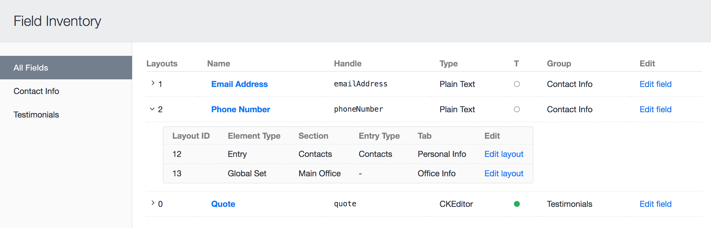

Inventory plugin for Craft CMS
==============================

Take stock of how your fields are being used.

***

>This version is for Craft 3. To install it, visit the Plugin Store in your site's Control Panel.
>
>For the Craft 2 version, see the [`v1` branch...](https://github.com/doublesecretagency/craft-inventory/tree/v1)

***

>"Am I using this field? _Where_ am I using this field?"

You no longer have to wonder... Inventory will show you exactly where your fields are being used!

\* _The "T" column shows whether a field is "Translatable"_

***

## Anything else?

We've got other plugins too!

Check out the full catalog at [doublesecretagency.com/plugins](https://www.doublesecretagency.com/plugins)
